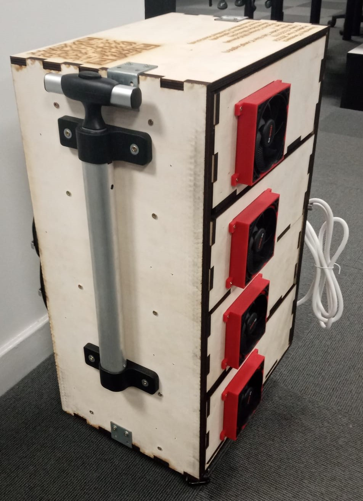
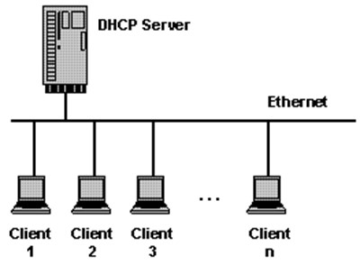
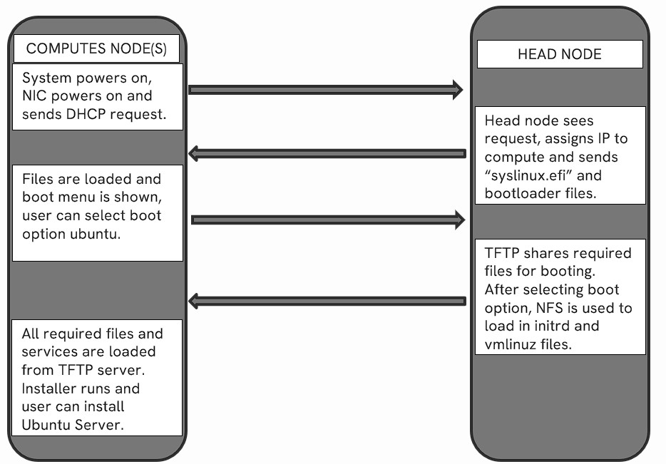
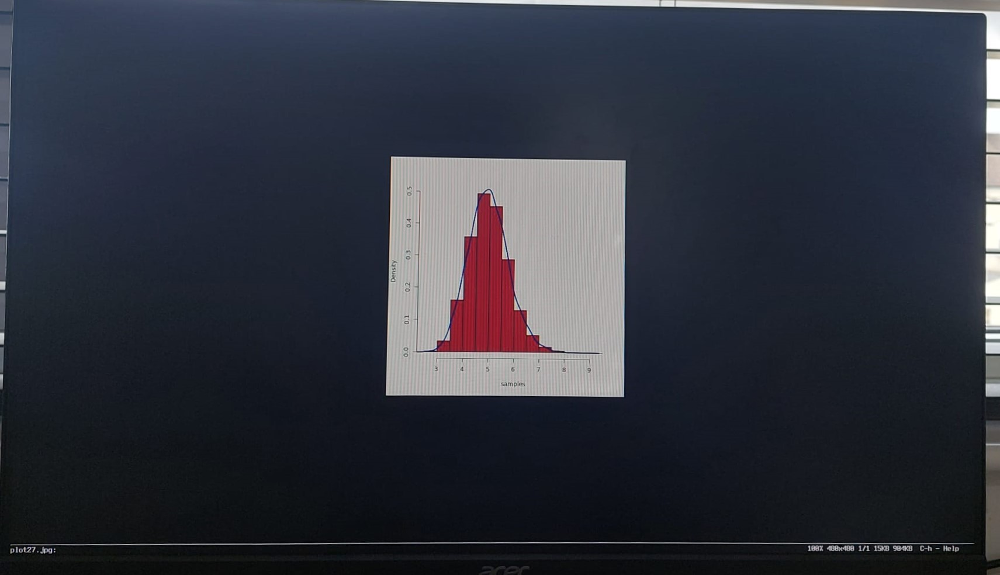
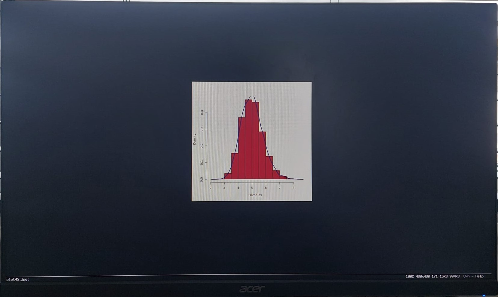

# Design & Development of a Modular High-Performance Computer (HPC)
## ELEE1119 Advanced Computer Engineering | Academic Year 2023/24

  
  

## Table of Contents
- [Design \& Development of a Modular High-Performance Computer (HPC)](#design--development-of-a-modular-high-performance-computer-hpc)
  - [ELEE1119 Advanced Computer Engineering | Academic Year 2023/24](#elee1119-advanced-computer-engineering--academic-year-202324)
  - [Table of Contents](#table-of-contents)
  - [Video](#video)
  - [Introduction](#introduction)
  - [Setup](#setup)
  - [Design and Manufacturing](#design-and-manufacturing)
    - [Cooling overview](#cooling-overview)
  - [Software Implementation](#software-implementation)
    - [PXE Boot](#pxe-boot)
    - [OpenSSH](#openssh)
    - [Slurm](#slurm)
    - [Testing with R](#testing-with-r)
  - [Recommendations](#recommendations)
  - [Contributors](#contributors)
  - [License](#license)

## Video

  

## Introduction
Welcome to the README file for the Advanced Computer Engineering module at the University of Greenwich, Academic Year 2023/24. This module is lead by Sebastian Blair. This project has been developed by `Team -1`. For full list of contributors consider the [contributors](#contributors) section.

This document provides an overview of the Design and Implementation of the High Performance Computing (HPC) System, including a brief explanation of the steps taken to develop the final products: a prototype, video and documentation demonstrating the collaborative effort and technical approach.

The HPC involves using multiple and interconnected computers in a cluster to perform complex computations. These clusters are nodes managed by schedulers to optimise resource usage. LinuxⓇ is the leading operating system for HPC. It is important to note that although a significant milestone has been reached with the creation of this prototype, there is room for further development and improvements.

## Setup
To carry out this project, the foundational components required are a Raspberry Pi (Model 4B), 3 Motherboards (ASUS CSB), and a 4/5 port switch. The Raspberry Pi acts as the head node, and the motherboards acting as compute nodes.

## Design and Manufacturing
To manufacture a copy of the HPC, an FDM (Fused Deposition Modeling) 3D Printer is necessary with a minimum hotbed size of 300 by 300mm, and a laser cutter with the minimum size of 300 by 600mm. 

PLA (Polylactic Acid) has been used as the filament of choice in this prototype, however ABS or PETG are just as appropriate. The laser cutting has been done using 9mm thick plywood, it is recommended to keep the thickness at 9mm. However, alternative materials such as acrlyic may be used instead of plywood. All CAD, STL, 3VS, and DXF design files can be located in the `hpc_case_design` folder of this repository. [Click Here](/hpc_case_design/design_readme.md) to learn more about the design and manufacturing of this project. 

### Cooling overview
Cooling for this HPC was done through a combination of various cooling methods like row cooling, forced convection and raised floor cooling. Knowing the wattage of the HPC allowed for calculation of the cooling requirements using BTU/br. With the intake of cool air, the exhaust space was calculated.  View the link below for more info:

- [Click Here](/hpc_case_design/cooling)

## Software Implementation
The HPC cluster here has been setup with two partitions, mycluster and mycluster2 with each having 2 nodes. The nodes are name node01, node02, node03 and node04. node01(headnode) and node04 are part of partition mycluster whereas node02 and node03 are part of partition mycluster2.

### PXE Boot
PXE (Pre-Boot Execution Environment) is a network protocol that allows a computer to boot and load its OS using resources from a server rather than local storage (USB stick, SSD, Hard Dive, etc.). This is done by leveraging the capabilities of DHCP, TFTP and NFS.
The three main packages used as DHCPD, TFTPD and NFS-Server.
DHCPD is used to create a network. TFTPD is used to create a TFTP Server and NFS is to share the OS image and kernel files. 

[Click here](/research_folder/Software/Implementation/PXE.md) to perform these prerequisite steps and PXE boot as a whole.

1. NETWORK SETUP - DHCP
   
   Firstly, all computers in the HPC setup must be able to communicate with each other. The Compute nodes (ASUS motherboards) are all connected to the head node (Raspberry pi) via LAN and are in network. Here, the DHCP (Dynamic Host Configuration Protocol) is used to allow the devices in the network (the other compute nodes) to be dynamically assigned an IP address. This simplifies the process of configuring IP addresses as it is not necessary to perform static routing and addressing on each device of the HPC. Additionally, DHCP assigns the subnet mask, default gateway, domain name server address and other configurations.
   
   To setup DHCP and get more in depth info, [click here](/research_folder/Software/Implementation/PXE.md#dhcp-server) and go to DHCP setup. 
   

  

2. SETTING UP TFTP SERVER_
   
   TFTP (Trivial File Transfer Protocol) is a simple, lightweight protocol used to transfer files between devices on a network. It is used to specify the directory which the TFTP server needs to  server to the client. In this case, it is used to serve all the related files required for booting and show the PXE Boot menu, where users can select the operating system to install. Since all related files are stored in the tftpboot directory, this is shared using TFTP.

   To setup TFTP and get more in depth info, [click here](/research_folder/Software/Implementation/PXE.md#configure-tftp-server) and go to TFTP setup.

3. NFS
   
   After selecting the operating system, it is important for users to be able to load the images, kernel files and more. These files need to be accessible over the network. Therefore, NFS (Network File System) is used. This can be done by adding the directory which contains these files as a shared directory across the network. 

   An ISO image of an Ubuntu distribution is firstly installed and mounted. Here, a live installer of Ubuntu 20.04 is installed. It is then copied to a certain directory (ubuntu). This directory now contains all the iso files necessary to install the OS on a machine. This directory needs to be exported over the network and available to compute nodes. Hence it must be configured in the NFS exports file.

   Finally, the PXE Boot menu needs to be configured. The initrd (Initial RAM disk)and vmlinuz (kernel image) files are required to be fetched once user selects operating system. This must be specified in the Boot menu file.

   To setup NFS and get more in depth info, [click here](/research_folder/Software/Implementation/PXE.md#nfs) and go to NFS section. 

Given below is an overview of the entire process

  

### OpenSSH
A prerequisite for slurm, to allow secure file transfer and communication between nodes. Allows remote access to compute nodes.  For instructions on setting up OpenSSH [Click Here](/research_folder/Software/Implementation/OpenSSH.md#openssh-setup)

### Slurm
Slurm is a highly scalable and flexible workload manager used primarily in HPC environments. Slurm provides mechanisms for inter-task communication and coordination, allowing tasks to share data or synchronize their operations as needed. 
SLURM needs to be able to perform its jobs on any node of the cluster. This makes it so that each node should be able to access the same files. Therefore, a shared storage would have to be created. In this project, a 16GB USB drive connected to the head node is exported as a Network File System.

[Click here](/research_folder/Software/Implementation/Slurm.md) to do setup USB as shared storage and setup SLURM between a head node and a compute node. In our setup slurm has been setup for the 4 nodes. Slurmd runs on all nodes whereas node01 runs slurmctld.

### Testing with R

Finally, to test the SLURM setup, an R script is created which generates 10000 random datasets, these datasets are then used to create a density plot jpg. Then the script is run 50 times parallelly on a single partition.  This has been tested and run on the partition mycluster.
Therefore, 50 plots are generated at once, as shown below.

Here are some of the plots:

  

  

  

[Click here](/research_folder/Software/Implementation/TestRPRogram.md) to view detailed documentation and code.
As a result, SLURM was used to run a job i.e., generating plot from 10000 samples 50 times in parallel. This mimics data processing of large datasets which is a major use case of HPC clusters. 

## Recommendations
Some of the project's next steps include incorporating technologies to improve its capabilities and test its abilities. Integrating SingularityCE can simplify the deployment of complex applications in HPC and scientific computing environments, leveraging containerisation for portability and reproducibility. John the Ripper could enhance security by identifying vulnerabilities in different operating systems. Prometheus and Jaeger will facilitate the monitoring and tracking framework, offering insights into system performance and operational dynamics. Furthermore, these integrations will be relatively easy by taking advantage of Slurm's compatibility with Docker.
Users are encouraged to consult the official documentation linked below for installation guidance on these technologies.

- [SingularityCE Documentation](https://docs.sylabs.io/guides/latest/user-guide/)
- [John the Ripper Documentation](https://github.com/openwall/john/tree/bleeding-jumbo)
- [Prometheus Documentation](https://prometheus.io/docs/prometheus/latest/installation/)
- [Jaeger Documentation](https://www.jaegertracing.io/docs/1.55/getting-started/)

## Contributors
- [@Wertasile](https://github.com/Wertasile)
- [@Cypherpol0](https://github.com/Cypherpol0)
- [@OneWayTicketToHell](https://github.com/OneWayTicketToHell)
- [@WJOchman](https://github.com/WJOchman)
- [@CompEng0001](https://github.com/CompEng0001) - Lecturer

## License

This work is licensed under <a href="http://creativecommons.org/licenses/by-nc-sa/4.0/?ref=chooser-v1" target="_blank" rel="license noopener noreferrer" style="display:inline-block;">CC BY-NC-SA 4.0</a>

