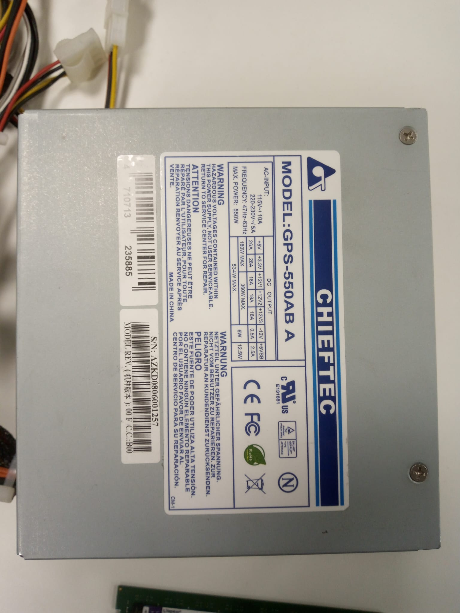

# <u> **PSU** (Power Supply Unit) </u>

## 1. <u> Chieftec GPS-550AB A 550W </u>

* <u> TECHNICAL DATA: </u>
  - Max. Power: 550 watts;
  - Standard: ATX12V 2.0 / EPS12V;
  - PFC (Power factor correction): active;
  - Cooling system: 1 fan (120 mm);

* <u> Connectors: </u>
  - Type of connector for the motherboard: 20+4 pin;
  - Number of connectors 4-pin CPU: 1;
  - Number of connectors 8-pin CPU: 1;
  - Number of connectors 6-pin PCI-E: 2;
  - Number of connectors 15-pin SATA: 4;
  - Number of connectors 4-pin IDE: 6;
  - Number of connectors 4-pin Floppy: 1;

* <u> Current strength: </u>
  DC OUTPUT
  - Current on the +3.3 V: 28 A;
  - Current on the +5 V: 26 A;
  - +5V & +3,3V combined: 180W MAX.
  - Current on the +12V line 1: 18 A;
  - Current on the +12V line 2: 18 A;
  - Current on the +12V line 3: 18 A;
  - +12V line 1, +12V line 2 & +12V line 3 combined: 360W MAX.
  - +5V, +3,3V, +12V line 1, +12V line 2 & +12V line 3 combined: 534W;
  - Current line -12: 0.5 A, 6W;
  - Current on the +5 V Standby: 2.5 A, 12.5W;
  - AC-INPUT
  - 115V~/ 10A
  - 220-230V~/ 5A
  - Frequency: 47Hz-63Hz

* <u> Additional information: </u>
  - Noise level: 27 DBA;
  - Color: grey;
  - Overvoltage protection: Yes;
  - Overload protection: Yes;
  - Short circuit protection: Yes;
  - Dimensions (HxWxD): 87x150x140 mm;

  

## 2. <u> Chieftec CTG-750C A-80 SERIES 750W </u>

* <u> TECHNICAL DATA: </u>
  - Model: A80 750W
  - Article no.: CTG-750C
  - EAN code: 4710713239388
  - Weight (Net/Gross): 2.15kg / 2.55kg
  - AC Input: 230V / 6.3 A
  - Frequency: 50 Hz
  - Current on the +5V: 22A
  - Current on the +3,3V: 22A
  - +5V & +3,3V combined: 130W
  - Current on the +12V line 1: 30A
  - Current on the +12V line 2: 30A
  - +12V line 1, +12V line 2 combined: 675W
  - P.F.	>0,9
  - Current on the -12V: 0,3A, 3,6W
  - Current on the +5V Standby: 2,5A, 12,5W
  - Maximum Power: 750W

* <u> Connectors: </u>
  - 20+4 PIN ATX: 1
  - 8 PIN EPS(4+4): 1
  - 8 PIN PCIe (6+2): 2
  - SATA: 6
  - MOLEX/FLOPPY: 4/2

* <u> Cable length (mm): </u>
  - 20+4 PIN ATX: 450
  - 8 PIN EPS(4+4): 550
  - 8 PIN PCIe (6+2): 2x550
  - SATA: 2x 450/150/150
  - MOLEX/FLOPPY: 2x 450/150/150

* <u> Features: </u>
  - ATX12V Version: ATX 12V 2.3
  - Efficiency: >85%
  - Dimension (DxWxH): 140 mm x 150 mm x 86 mm
  - PFC: Active PFC (0,9)
  - Fan: 120mm silent fan
  - Security: AFC (Automatic Fan speed Control)
  - OPP: (Over Power Protection)
  - OVP: (Over Voltage Protection)
  - SCP: (Short Circuit Protection)
  - SIP: (Surge & Inrush Protection)
  - UVP: (Under Voltage Protection)
  - Warranty: 24 Months

# <u> **SSD (Solid State Drive)** </u>

## 1. <u> Samsung Solid State Drive V-NAND 860 EVO 500GB </u>

* <u> Usage Application: </u>
  - Client PCs

* <u> Interface:  </u>
  - SATA 6 Gbps Interface, compatible with SATA 3 Gbps & 1.5 Gbps interfaces

* <u> Hardware Information: </u>
  - Capacity: 500GB
  - Controller: Samsung MJX Controller
  - NAND Flash Memory: Samsung V-NAND 3bit MLC
  - DRAM Cache Memory: 512MB LPDDR4
  - Dimensions: 100x 69.85x 6.8(mm)
  - Form Factor: 2.5 inch

* <u> Performance (Up to.): </u>
  - Sequential Read: 550 MB/s
  - Sequential Write: 520 MB/s
  - 4KB Ran. Read (QD1): 10,000 IOPS
  - 4KB Ran. Write (QD1): 42,000 IOPS
  - 4KB Ran. Read (QD32): 42,000 IOPS
  - 4KB Ran. Write (QD32): 90,000 IOPS

* <u> Power Consumption: </u>
  - Idle/ DIPM on: 50 mW
  - Active (Avg.)/ Read/Write: 2.5 W
  - Devslp: 2 mW

* <u> Reliability: </u>
  - Temp.
    - Operating: 0°C to 70°C
    - NonOperating: -45°C to 85°C
  - Humidity: 5% to 95% non-condensing
  - Shock / NonOperating: 1,500G, duration: 0.5ms, 3 axis
  - Vibration / NonOperating: 20~2,000Hz, 20G
  - MTBF: 1.5 million hours
  
* <u> Warranty: </u>
  - TBW: 300TB
  - Period: 5 year limited

* <u> Supporting Features: </u>
  - TRIM (Required OS support), Garbage Collection, S.M.A.R.T

* <u> Data Security: </u>
  - AES 256-bit Full Disk Encryption, TCG/Opal V2.0, Encrypted Drive(IEEE1667)

# References
- [Chieftec GPS-550AB A 550W](http://specsan.com/power-supply-chieftec/chieftec-gps-550ab-a-550w/) [Accessed: 22/01/2024];
- [Chieftec CTG-750C A-80 SERIES 750W](https://www.chieftec.eu/products-detail/107/A-80_SERIES/130/CTG-750C) [Accessed: 22/01/2024];
- [Samsung Solid State Drive V-NAND 860 EVO 500GB](https://download.semiconductor.samsung.com/resources/data-sheet/Samsung_SSD_860_EVO_Data_Sheet_Rev1.pdf) [Accessed: 22/01/2024];