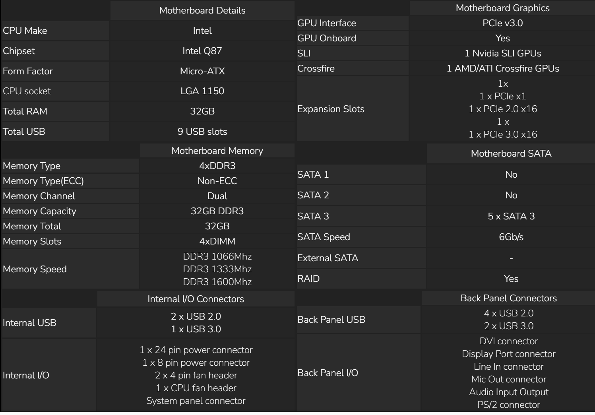

# Raspberry pi 3 model B
1.	Processor (CPU): Broadcom BCM2837B0, Cortex-A53 (ARMv8) 64-bit SoC @ 1.2GHz Quad Core
2.	RAM: 1GB LPDDR2 SDRAM
3.	Wireless Connectivity:

    •	Wi-Fi: 802.11n Wireless LAN

    •	Bluetooth: Bluetooth 4.2, BLE (Bluetooth Low Energy)

4.	Ethernet: 10/100 BaseT Ethernet socket
5.	USB Ports: 4 × USB 2.0 ports
6.	Video Output:
•	HDMI (full size)
•	MIPI DSI display port
•	MIPI CSI camera port
7.	Audio: 3.5mm 4-pole audio/composite video out jack, HDMI, and a 4-pole header for stereo audio
8.	Storage: microSD card slot for operating system and data storage
9.	GPIO (General Purpose Input/Output): 40 GPIO pins
10.	Power Supply: 5V/2.5A DC power input
11.	Power over Ethernet (PoE): Enabled via HAT (Hardware Attached on Top)
12.	Operating System Support: Raspbian (officially supported), and various other Linux distributions

https://www.raspberrypi.com/products/raspberry-pi-3-model-b/

# Asus CS-B
•	CPU 
- Intel® Socket 1150 for 4th Generation Core™ i7/Core™ i5/Core™ i3/Pentium®/Celeron® Processors. 
- Supports Intel® 22 nm CPU 
- Supports Intel® Turbo Boost Technology 2.0 
    * The Intel® Turbo Boost Technology 2.0 support depends on the CPU types.

•	Chipset  
- Intel® Q87 

•	Memory
- 4 x DIMM, Max. 32GB, DDR3 1600/1333/1066 MHz Memory
- Dual Channel Memory Architecture 
    *Refer to www.asus.com for the Memory QVL (Qualified Vendors Lists). 

##	Graphic
Integrated Graphics Processor 
Multi-VGA output support : DVI-D/DVI-I/DisplayPort ports
- Supports DVI-D with max. resolution 1920 x 1200 @ 60 Hz
- Supports DVI-I with max. resolution 1920 x 1200 @ 60 Hz
- Supports DisplayPort with max. resolution 4096 x 2160 @ 24 Hz / 3840 x 2160 @ 60 Hz 
Supports up to 3 displays simultaneously
## Expansion Slots
- 1 x PCIe 3.0/2.0 x16 (beige) 
- 1 x PCIe 2.0 x16 (x4 mode, black) 
- 1 x PCIe 2.0 x1 (brown) 
- 1 x PCI (beige) 
- 1 x mini-PCIe 2.0 x1 (full-length, black) * 
## Storage
Intel® Q87 chipset : * 
5 x SATA 6Gb/s port(s), brown 
1 x mini-SATA 6Gb/s port(s), black 
Support Raid 0, 1, 5, 10 
Supports Intel® Smart Response Technology, Intel® Rapid Start Technology, Intel® Smart Connect Technology
## LAN
Intel® I217LM, 1 x Gigabit LAN Controller(s) 
Realtek® 8111G, 1 x Gigabit LAN Controller(s)
## Audio
Realtek® ALC887-VD 8-Channel High Definition Audio CODEC 
- Supports : Jack-detection, Multi-streaming, Front Panel Jack-retasking, Anti-pop Function
## USB Ports
Intel® Q87 chipset :
- 4 x USB 3.1 Gen 1 port(s) (2 at back panel, , 2 at mid-board) 

Intel® Q87 chipset :
- 8 x USB 2.0 port(s) (4 at back panel, , 4 at mid-board)

## Special Features
- TUF Components (Alloy choke, Ti-Cap. & MOSFET; certified by military-standard) 
ASUS Exclusive Features :
- AI Suite 3
- ASUS UEFI BIOS EZ Mode featuring friendly graphics user interface 
ASUS Quiet Thermal Solution :
- ASUS Fan Xpert 2 
ASUS EZ DIY :
- ASUS CrashFree BIOS 3
- ASUS EZ Flash 2
- ASUS MyLogo 2 
ASUS Q-Design :
- ASUS Q-Slot
- ASUS Q-DIMM 

TPM IC Onboard 
Bespoke Motherboard Design & Commercial Focused Features : 
- Layout Design: Maximized microATX layout for better thermal performance
- ASUS Watchdog Timer AP: Your system will always run, non-stop
- Total ESD Guard: Strongest electrostatic protection for maximum lifespan
- Stainless Steel Back I/O: Three times more corrosion resistance
- Overcurrent Protection: Short circuit prevention, protects your system
## Operating System Support
Windows® 8 
Windows® 7
## Back I/O Ports
1 x PS/2 keyboard (purple) 
1 x PS/2 mouse (green) 
1 x DVI-D 
1 x DVI-I 
1 x DisplayPort 
2 x LAN (RJ45) port(s) 
2 x USB 3.1 Gen 1 
4 x USB 2.0 
3 x Audio jack(s) 
## Internal I/O Ports
1 x USB 3.1 Gen 1 connector(s) support(s) additional 2 USB 3.1 Gen 1 port(s) 
2 x USB 2.0 connector(s) support(s) additional 4 USB 2.0 port(s) 
1 x LPT1 header 
2 x COM port(s) connector(s) 
5 x SATA 6Gb/s connector(s) 
1 x mSATA connector 
1 x CPU Fan connector(s) 
2 x Chassis Fan connector(s) 
1 x 24-pin EATX Power connector(s) 
1 x 8-pin ATX 12V Power connector(s) 
1 x Front panel audio connector(s) (AAFP) 
1 x Internal speaker connector(s) 
1 x System panel(s) 
1 x Chassis Intrusion connector(s) 
1 x Clear CMOS jumper(s)
## Accessories
User's manual 
I/O Shield 
2 x SATA 6Gb/s cable(s)
## BIOS
128 Mb Flash ROM, AMI BIOS, PnP, DMI2.0, WfM2.0, SM BIOS 2.5, ACPI 2.0a, Multi-language BIOS, ASUS EZ Flash 2, ASUS CrashFree BIOS 3
## Manageability
WfM 2.0, DMI 2.0, WOL by PME, WOR by PME, PXE
## Support Disc
Drivers 
ASUS Utilities 
ASUS Update 
Anti-virus software (OEM version) 
## Form Factor
mATX Form Factor 
9.6 inch x 9.6 inch ( 24.4 cm x 24.4 cm )
## Note
* Mini-SATA and mini-PCIe share the same slot. When mini-SATA card is inserted, mini-PCIe will not be usable, and vice versa.
* Full-length mini-PCIe slot supports full/half length mini card.
https://www.asus.com/commercial-motherboard/csb/specifications/

 

# Okdo Rock 4c+
•	ROCK 4C+ SBC based on the powerful Rockchip RK3399 T SoC 
•	Hexa-core processor with Arm® big.LITTLE™ dual Arm Cortex® A72, quad Cortex-A53 CPU, and Arm Mali™ T860MP4 GPU 
•	4GB 64-bit RAM and eMMC socket 
•	Power on/off button, integrated fan control, external antenna & audio jack 
•	Dual micro-HDMI ports supporting displays of up to 4Kp60 resolution 
•	Bluetooth 5.0 with BLE, Gigabit Ethernet and Wireless LAN 
•	Memory - Dual channel (64bit) 4GB LPDDR4 RAM  
•	Power Requirements  
SB C 5V/3A  
5V Power applied to the GPIO PIN 2 & 4 
The recommended power source capacity is at least 5V/3A 
•	USB 
2x USB2 HOST ports 
1x USB3 OTG/HOST port 
1x USB3 HOST port 
•	Connectivity 
802.11 b/g/n/ac (WiFi 5) Wireless LAN 
Bluetooth 5.0 with BLE 
Gigabit Ethernet
## Why is Rock Pi 4 Model C better than Raspberry Pi 3 Model B Plus?
•	3GB more RAM memory 
4GBvs1GB 
•	1.64x faster CPU speed  
(The CPU speed indicates how many processing cycles per second can be executed by a CPU, considering all of its cores (processing units). It is calculated by adding the clock rates of each core or, in the case of multi-core processors employing different microarchitectures, of each group of cores.) 
2 x 1.8GHz & 4 x 1.4GHzvs4 x 1.4GHz 
•	Uses big.LITTLE technology  
(Using big.LITTLE technology, a chip can switch between two sets of processor cores to maximize performance and battery life. For example, when playing a game the more powerful cores will be used to increase performance, whereas checking email will use the less powerful cores to maximize battery life.) 
•	11mm shorter  
(The height represents the vertical dimension of the product.) 
45mmvs56mm 
•	1968GB more external memory supported (The maximum amount of external storage memory supported by the device.) 
2000GBvs32GB 
•	1.2 newer version of OpenGL ES  
(OpenGL ES is used for games on mobile devices such as smartphones. Newer versions support better graphics.) 
3.2vs2 
•	Has USB Type-C 
•	0.8 newer Bluetooth version 
5vs4.2 
#### Note: Neither will be used for computational purposes

# NVIDIA® QUADRO® K620
## SPECIFICATIONS  
•	GPU Memory - 2 GB DDR3  
•	Memory Interface - 128-bit  
•	Memory Bandwidth - 29.0 GB/s  
•	NVIDIA CUDA® Cores - 384  
•	System Interface - PCI Express 2.0 x16  
•	Max Power Consumption - 45 W  
•	Thermal Solution - Ultra-Quiet Active Fansink  
•	Form Factor - 2.713” H × 6.3” L, Single Slot, Low Profile  
•	Display Connectors - DVI-I DL + DP 1.2  
•	Max Simultaneous Displays - 2 direct, 4 DP 1.2 Multi-Stream  
•	Max DP 1.2 Resolution - 3840 x 2160 at 60 Hz  
•	Max DVI-I DL Resolution - 2560 × 1600 at 60 Hz  
•	Max DVI-I SL Resolution - 1920 × 1200 at 60 Hz  
•	Max VGA Resolution - 2048 × 1536 at 85 Hz  
•	Graphics APIs - Shader Model 5.0, OpenGL 4.53 , DirectX 11.24 , Vulkan 1.03  
•	Compute APIs - CUDA, DirectCompute, OpenCL™ 
•	Idle temperature – 29oC 
•	Load temperature – 70oC to 85oC (also optimal temperature) 
