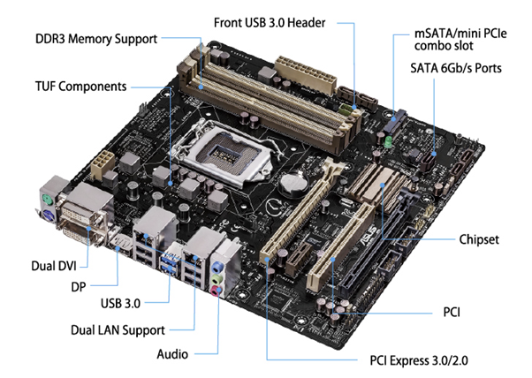
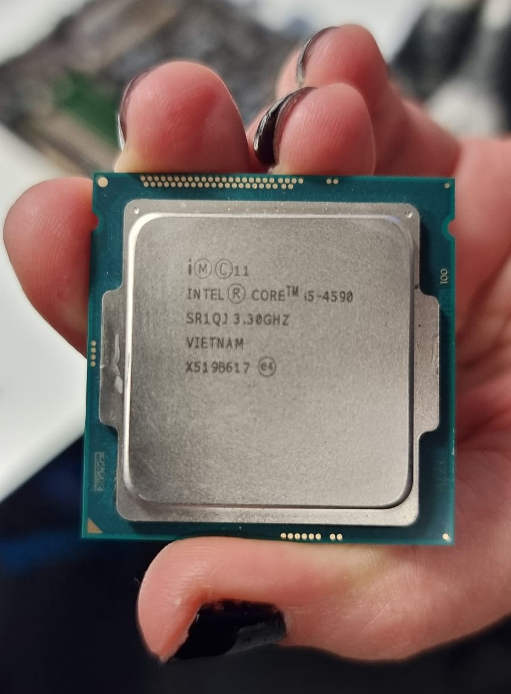
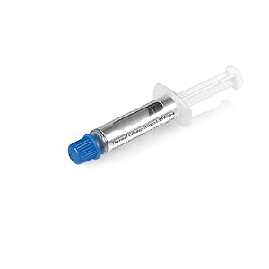

# ASUS CS-B Motherboard Research

This file presents an overview of the ASUS CS-B Motherboard.

## Specifications Summary
1. CPU:
    - LGA1150 socket for Intel 4th Gen Core i7/i5/i3, Pentium, and Celeron processors. 
2. Chipset:
    - Intel Q87 Express Chipset
3. Memory:
    - 4 x DIMMs, max. 32GB, DDR3 1600 / 1333 / 1066 MHz, non-ECC, un-buffered memory. 
    - Dual-channel memory architecture
4. Graphics:
    - Integrated Graphics Process
    - Multi-VGA output support: DisplayPort, DVI-D, and DVI-I ports
        - Supports DisplayPort with max. resolution of 4096 x 2160 @24Hz / 3840 x 2160 @60Hz
        - Supports DVI-D with max. resolution of 1920 x 1200 @60Hz
        - Supports DVI-I with max. resolution of 1920 x 1200 @60Hz
    - Maximum shared memory of 1024MB
5. Expansion Slots:
    - 1 x PCI Express 3.0/2.0 x16 slot
    - 1 x PCI Express 2.0 x16 slot (x4 mode)
    - 1 x PCI Express 2.0 x1 slot
    - 1 x PCI slot
    - 1 x mini PCIe (Full length, supports full/half mini card)
6. Storage:
    - Intel Q87 Express Chipset:
        - 5 x Serial ATA 6.0 Gb/s connectors
        - 1 x mSATA connector
7. LAN:
    - Intel I217LM Gigabit LAN controller
    - Realtek RTL8111G-CG Gigabit LAN controller
8. USB:
    - 4 x USB 3.0 ports 
    - 8 x USB 2.0 ports
9. TUF Components:
    - TUF 10K Ti-Cap
    - TUF Alloy Chokes
    - TUF MOSFETS
10. Rear Panel I/O Ports:
    - 1 x PS/2 Keyboard Port (purple)
    - 1 x Ps/2 mouse port (green)
    - 1 x DVI-I port
    - 1 x DVI-D port
    - 1 x DisplayPort port
    - 2 x LAN (RJ-45) ports
    - 4 x USB 2.0/1.1 ports
    - 2 x USB 3.0 ports
    - 3 x Audio jacks
11. Internal Connectors/Switches/Buttons:
    - 1 x USB 3.0 connector supports additional 2 USB 3.0 ports
    - 2 x USB 2.0 connectors support additional 4 USB 2.0 ports
    - 5 x SATA 6.9 Gb/s connectors
    - 1 x mSATA connector
    - 1 x Chassis intrusion connector
    - 1 x Clear CMOS jumper
    - 1 x 4-pin CPU fan connector
    - 2 x 4-pin chassis fan connectors (with DC)
    - 1 x Front panel audio connector (AAFP)
    - 1 x System panel connector
    - 1 x Speaker connector
    - 1 x LPT header
    - 2 x COM Headers
    - 1 x 24-pin ATX power connector
    - 1 x 8-pin ATX 12V power connector
    - 1 x DIS ME jumper
    - TPM IC onboard
12. Form Factor: 
    - MicroATX Form Factor: 9.6" x 9.6" (24.4cm x 24.4cm)

# Intel Core i5-4590 Processor Research

## CPU Specifications
1. Total Cores = 4
2. Total Threads = 4
3. Processor Base Frequency = 3.30GHz
4. Max Turbo Frequency = 3.70GHz
5. Cache = 6MB Intel Smart Cache
6. Bus Speed = 5 GT/s
7. TDP = 84W

# Thermal Paste Research

## StarTech Thermal Paste GR-005 Specifications
- Metal-based compound containing metal oxide
- Thermal condictivity of more than 1.93 W/m-K
- Negligible electrical conductivity
- Stable performance over a wide temperature range
- Four to six applications per tube
- Resealable syringe applicator

# References
1. [ASUS CS-B Motherboard Specification Document](asus_csb_motherboard_spec.pdf) [Accessed: 22/01/2024]
2. [Intel core i5-4590 Processor](https://www.intel.com/content/www/us/en/products/sku/80815/intel-core-i54590-processor-6m-cache-up-to-3-70-ghz/specifications.html) [Accessed: 22/01/2024]
3. [StarTech Thermal Paste GR-005](https://www.amazon.co.uk/StarTech-com-Metal-Thermal-Compound-Heatsink-White/dp/B00006B8DX?th=1) [Accessed: 22/01/2024]