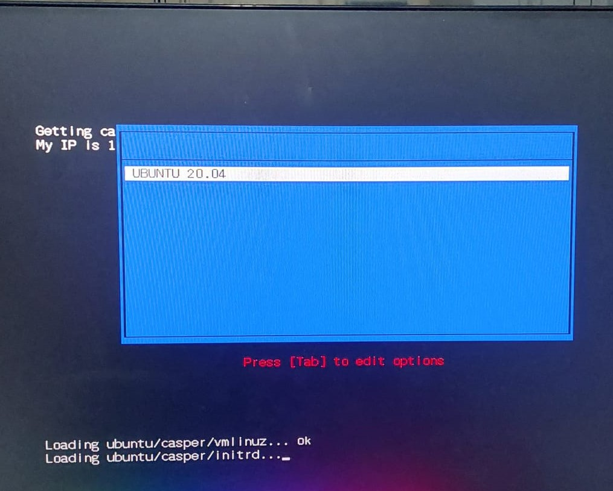

# PXE - Preboot Execution Environment - Live Booting Ubuntu Over LAN

## Introduction

A PXE environment is the process of having your devices boot from its network card. PXE enables computers within a network to Install Operaing System over Network. 

In this context, an HPC cluster is being built which consists of head and compute nodes. PXE enables these compute nodes to boot over a network / boot from the head node by the head node sending the OS and other required files to the compute nodes that enter the network. A PXE server needs to be setup at head node (Raspberry Pi) and the BIOS setting on the compute nodes must be changed to boot over the network. 

When dealing with multiple machines, PXE solves the issue of having to manually install OS onto each motherboard separately. It does this by bootstrapping the machine over the network. You dont need to insert a CD or USV into the motherboards one by one.

## Components required to run PXE and configuration

Here, Ubuntu Server 20.04.5 is being booted on each compute node over LAN. Therefore, each ASUS motherboard needs to connected to the Raspberry Pi via LAN.
Given below is the file structure of the entire project. 
```
├── etc
│   ├── dhcp
│   │   ├── dhcpcd.conf
│   ├── default
│   │   ├── nfs-kernel-server
│   │   └── tftpd-hpa
│ 
├── tftpboot
│   ├── pxelinux.cfg
│   │   ├── default
│   ├── ubuntu
│   │   ├── boot
│   │   ├── casper
│   │   │    ├──initrd
│   │   │    └── vmlinuz
│   │   ├── dists
│   │   ├── EFI
│   │   ├── install
│   │   ├── isolinux
│   │   ├── md5sum.txt
│   │   ├── pool
│   │   ├── preseed
│   │   ├── ubuntu
│   ├── syslinux.efi
│   ├── ldlinux.e64
│   ├── libutil.32
│   ├── menu.c32

```

Below are the packages required:

- DHCPD (DHCP server): for creating a DHCP server
- TFTPD: for creating a TFTP server
- NFS-SERVER: for transferring images file

we also need some common files from syslinux which is a suite of bootloaders for PXE network boots.
This package contains the bootloader for the Unified Extensible Firmware Interface (UEFI) whwich is the method via which we connect the computer's firmware to the OS (UEFI IPv4). 


```
sudo apt-get install syslinux-common syslinux-efi  
```

We create a directory called tftpboot to store all configuration files

files from the syslinux library are stored here

we need few files from syslinux libraries
They are
- ldlinux.e64 - this loads the kernels
- libutil.32 - utilities required for booting
- menu.c32 - menu
- syslinux.efi

They must be copied into the tftpboot directory

```
cd /usr/lib/syslinux/modules/efi64/
sudo cp {ldlinux.e64,libutil.c32,menu.c32} /tftpboot/
cd /usr/lib/SYSLINUX.EFI/efi64
sudo cp syslinux.efi /tftpboot/
```

We also need to create a folder that will store default configuration file i.e, the entries that will appear in the boot menu. *THIS FOLDER NEEDS TO BE CALLED pxelinux.cfg.*

```
cd /tftpboot/
mkdir pxelinux.cfg
```


### DHCP server

The first step is to set up a DHCP Server.

This is done by firstly installing the dhcp package.

```
sudo apt-get install isc-dhcp-server 
```

You need to set a static IP address for your head node/ server machine (raspberry pi). This is done by accessing the network configuration files located in etc/netplan/00-installer-config.yaml. Below is configuration file. Here ethernet interface eth0 is configured as 192.168.2.1.

```
network:
  version: 2
  wifis:
    renderer: networkd
    wlan0:
      access-points
        'SSID':           
           password:'password'
      dhcp4:true
      optional:true
  ethernets:
    eth0:
      dhcp4: no
      addresses:
        - 192.168.2.1/24           
      gateway4: 192.168.2.254
```
Next we need to configure our DHCP server. This is located in /etc/dhcp/dhcpd.conf

- We have specified our network/ subnet which is 192.168.2.0 and netmask 255.255.255.0
- We also need to specify range of IP address we can assign to clients in network.
- We also need to specify the IP address of router (which is our device) - 192.168.2.1.
- We can configure the default and amximum lease time of an IP address.
- We also have configured DNS servers that are being sent from DHCP.
- Set the DHCP server as authouritative
- We need to specify where the TFTP server is, which is the Raspberry Pi which has a statically assigned IP address (192.168.2.1). This is the next-server parameter.
- We need to also specify the file that needs to be pointed at which is syslinux.efi. This means during the PXE server it will try to fetch the syslinux.efi file from the TFTP root directory which is "/tftpboot".

```  
#MY SUBNET CONFIG
subnet 192.168.2.0 netmask 255.255.255.0{
    range 192.168.2.2 192.168.2.200;
    option routers 192.168.2.1;
    option broadcast-address 192.168.2.255;
    default-lease-time 3600;
    max-lease-tine 86400;
    next-server 192.168.2.1;
    filename "syslinux.efi";
}
option domain-name "example.org";
option domain-name-servers 1.1.1.1, 1.0.0.1;

authoritative;
```


After this we need to edit the isc-dhcp-server file. Here we need to specify which interface should be listening for DHCP requests. In our case, It should be the LAN port that is connected to the compute nodes which is eth0.
It is located in /etc/default/isc-dhcp-server.

```
INTERFACESv4="eth0"
INTERFACES v6=""
```

### Configure TFTP Server
The TFTP Server that will be configured sends all related files i.e.tftpboot directory for PXE booting from the head node to compute node.
Given below is the installation of package required to setup TFTP Server.
```
sudo apt-get install tftpd-hpa
```

The configuration for TFTP Server is located in /etc/default/tftpd-hpa.

In the configuration file you must specify that the root directory for server is /tftpboot.
You must also specify the interface that serves  
Given below is the tftpd-hpa configuration file.


```
# /etc/default/tftpd-hpa
INTERFACEv4="eth0"

TFTP_USERNAME="tftp"
TFTP_DIRECTORY="/tftpboot"
TFTP_ADDRESS="0.0.0.0:69"
TFTP_OPTIONS="--secure"
```

You also need to enable UDP port 69 as that is the port address specified in the configuration file.

```
sudo ufw allow 69
```
### NFS

NFS (Network File System) IS REQUIRED FOR BOOTING THE LIVE DISTROS. It sends the required kernel and image files to the compute nodes. Firstly, we must install the nfs package.


```
sudo apt-get install nfs-kernel-server
```

We need to edit the nfs-kernel-server settings. This is located in /etc/default nfs-kernel-server.
By deafault NFS binds a number of ports for NFS usage, and those ports may be blocked by the firewall. Therefore, it is important to specify the port for NFS usage which is 40000

```
# Number of servers to start up
RPCNFSDCOUNT=8
# Runtime priority of server (see nice(1))
RPCNFSDPRIORITY=0

RPCMOUNTDOPTS="-p 40000"

# Do you want to start the svcgssd daemon? It is only required for Kerberos
# exports. Valid alternatives are "yes" and "no"; the default is "no".
NEED_SVCGSSD=""
# Options for rpc.svcgssd.
RPCSVCGSSDOPTS=""
```

Allow the port 40000 in firewall.
port 11 and 2049 are required for the portmapper and NFS service respectively.
```
sudo ufw allow 40000
sudo ufw allow 2049
sudo ufw allow 80
```

Configure the exports file. It is located in /etc/exports. Specify the directory to export and allow it to be shared to entire subnet/ network Also add options (ro, no_root_squash, no_subtree_check).

- ro - instructs read oly mounting
- no_root_squash - will allow root users to mount the nfs share.  

```
/tftpboot/ubuntu   192.168.0.0/24 (ro, no_root_squash, no_subtree_check)
```

Run the export file
```
sudo exportfs -av
```
Download the iso for the OS on the compute nodes. Ensure that the iso is ready for netbooting. It needs all the necessary files in the initrd and linux kernel (vmlinuz) for it to be able to boot. Install this in the home directory

```
cd ~
sudo wget http://releases.ubuntu com/20.04/ubuntu-20.04.6-live-server-amd64.iso
```

Mount the image and copy this to ubuntu folder
```
cd /tftpboot
mkdir ubuntu
sudo mount ~/ubuntu-20.04.2.0-desktop-amd64.iso /mnt
sudo cp -r /mnt/. ubuntu/
```

ubuntu will now get the following folders from the mounted iso file
- boot
- casper
- dists
- EFI
- isntall
- isolinux
- md5sum.txt
- pool
- pressed
- ubuntu


### PXE-BOOT MENU
Casper folder contains the intird and vmlinuz files. 

This needs to fetched when you select the Ubuntu OS from the Boot Menu. Therefore you need to edit your default file to do this.
default folder that needs to located is at /tftpboot/pxelinux.cfg.
- The LABEL to be displayed in configured - UBUNTU 20.04
- kernel file path relative to TFTP server.
- initrd (Initial RAM disk) file relative to TFTP Server.
- Configuration to botain IP address via DHCP and perform netboot via NFS. 

```
UI menu.c32

LABEL ubuntu 20.04 nfs boot
        MENU LABEL UBUNTU 20.04
        kernel ubuntu/casper/vmlinuz
        initrd ubuntu/casper/initrd
        append nfsroot=192.168.2.1:/tftpboot/ubuntu ro netboot=nfs boot=casper ip=dhcp
```
## CONCLUSION

All the necessary configurations have been made. Now all the 3 services needed to be restarted.

```
sudo systemctl restart isc-dhcp-server
sudo systemctl restart tftpd-hpa
sudo systemctl restart nfs-kernel-server
```

After this you should power on your compute node
The compute node will connect to the network and obtain an IP address.
After this the bootmenu shows up after acquiring syslinux.efi



After selecting Ubuntu20.04, the initrd and vmlinuz files load.
Eventually Ubuntu starts on the compute node after loading all dependencies.
It is by default connected to the head node as the OS and all its components were loaded due to the compute node being in the network connected to head node. Therefore, no static routing and addressing is required and compute node is ready to use.

### References

1. [Ubuntu PXE Setup](https://medium.com/jacklee26/set-up-pxe-server-on-ubuntu20-04-and-window-10-e69733c1de87)
2. [Setting up an UEFI PXE server on Linux](https://www.youtube.com/watch?v=U3RC20ANomk)
3. [How to configure PXE Network Boot Server for Ubuntu 18.04](https://www.youtube.com/watch?v=1pa4Y64y2Go&t=40s)
4. [Ubuntu Ask](https://askubuntu.com/questions/1292032/how-can-current-ubuntu-versions-be-installed-via-pxe-network-boot-and-an-automat)