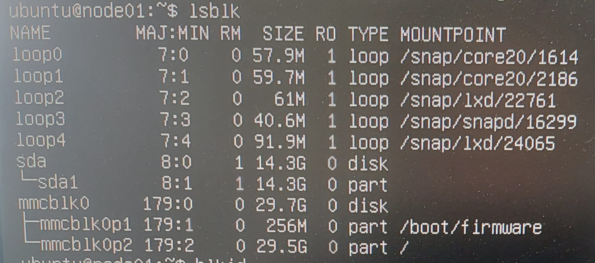

# Introduction - SLURM Workload Manager - Simple Linux Utility for Resource Management

SLURM is a Workload Manager / Scheduler. The scheduler accepts jobs and when nodes are available, they are run on the nodes. SLURM runs a controller daemon on the master node and 
# Components/steps required to run SLURM and configuration

Given below is the directory tree for the head node. All relevant files for setting up SLURM are listed below.
- etc is a standard directory, installation of all required packages and creating some files lead to the population of that directory.
- clusterfs is a populated with copies of relevant files from the head node as it is set up as a shared storage that can be accessed by all nodes. 

```
├── etc
│   ├── munge
│   │   ├── munge.key
│   ├── slurm-llnl
│   │   ├── slurm.conf
│   │   ├── cgroup.conf
│   │   └── cgroup_allowed_devices_file.conf
│ 
├── clusterfs
│   ├── munge.key
│   ├── slurm.conf
│   ├── cgroup.conf
│   ├── cgroup_allowed_devices_file.conf

```

Below are the packages required:

- NFS-SERVER: for setting up nfs on server. Download on head node
- NFS-CLIENT: for setting up nfs on client. Download on compute nodes
- SLURM CONTROLLER PACKAGES: for setting up on head node
- SLURM CLIENT PACKAGES: for setting up on compute node
- MUNGE: required for authentication on both head and compute nodes

Installation on Compute node (repeat the below for all compute nodes)
```
sudo apt install munge nfs-common slurmd slurm-client -y
```

Installation on head nodes 
```
sudo apt install munge nfs-kernel-server slurm-wlm -y
```


## Prerequisite setup

In SLURM, the scheduler expects hostname to follow a pattern, therefore the raspberry pi head node has a hostname of node01. The other compute nodes have a subsequent hostname of node02,node03,node04 and so on.
To change hostname
```
sudo hostname <enter the hostname>
```

Edit the hostname file using sudo nano /etc/hostname and add just the hostname and the rest of the file must be empty.

Edit the hosts file using sudo nano /etc/hosts

## Making a Shared Storage

For a cluster to run optimally, it is important that the job can run on any node on the cluster. Therefore, all nodes must be able to access the same files. Therefore, a 16GB USB drive is connected to the head node (raspberry pi) and that drive is shared accross the network. The drive is exported as a network file system and is mounted on all nodes so that it can be accessed.
Here, the USB drive is formatted and a d

### STEP 1

<i>Perform the below actions in the head node</i>

Locate the flash drive using ```lsblk``` command. 





The flash drive is sda. perform the following steps:

```
fdisk /dev/sda

Command (m for help): p   # to view partitions
```

Delete all exisitng flash drive partitions and create new partition
```
Command (m for help): d   # to enter mode to delete partitions

# In our case there was just one partition

Command (m for help): 1

Command (m for help): n   # To create partition

Partition number (1-<no. varies based on drive>, default 1): 1
```
When prompted with First sector and Last sector just click enter, this creates new partition of type Linux filesystem and then write w and enter to save changes.

To make our file system perform the following

```
sudo mkfs /dev/sda1
```

The above steps led to the formatting of the USB drive and creating one partition to be shared across the network.
Create a directory to mount. The USB strick is mounted onto this directory. Change the permissions to make folder accessible

```
sudo mkdir /clusterfs
sudo chown nobody.nogroup -R /clusterfs
sudo chmod 777 -R /clusterfs
```

Next, Automatic mounting needs to be setup. This enables the USB drive to mount onto the directory automatically when head node boots. Given below are the steps to perform setup automatic mounting.

Identify the UUID using command ```blkid```. Take note of the UUID for the /dev/sda directory and the value of PE. fstab file needs to be edited to mount the drive on boot. Enter the file using ```sudo nano /etc/fstab``` and add the below

```
UUID=<add your UUID here without quotations>  /clusterfs  <add your PE value here without quotations>  defaults 0 2
```

now to mount the drive in the location we specified i.e. clusterfs

```
mount /dev/sda1 /clusterfs
```

permissions need to be re-set as drive has been mounted on to it
```
sudo chown nobody.nogroup -R /clusterfs
sudo chmod -R 776 /clusterfs
```
### STEP 2
export the mounted drive so other nodes can access them. Enter the /etc/exports file using ```sudo nano /etc/exports```

<i>This tutorial assumes you have followed the PXE boot tutorial already. If not set up DHCP by following instructions here (insert link) </i>

```
# add this below the already existing line
/clusterfs    192.168.2.0/24(rw,sync,no_root_squash,no_subtree_check)
sudo exportfs -a     # to update the NFS kernel server
```
### STEP 3

Now, to mount the directory on all the other nodes perform the following. This is to be done on the compute node and repeat below steps for all compute nodes.

Create the directory onto which the directory of the USB device from the head node will be mounted. Change its permissions for accesssibility.

```
sudo mkdir /clusterfs
sudo chown nobody.nogroup /clusterfs
sudo chmod -R 777 /clusterfs
```
Once again, fstab file needs to be edited to automatically mount the drive on boot. Enter the file using ```sudo nano /etc/fstab``` and add the below
```
192.168.2.1:/clusterfs    /clusterfs    nfs    defaults   0 0
sudo mount -a
```

## CONFIGURE THE HEAD NODE
Add the hostname of all the other nodes to the /etc/hosts file
```
<ip addr of node02>      node02
<ip addr of node03>      node03
<ip addr of node04>      node04
```

Finally Configure the required SLURM files. Acquire the default SLURM Configuration and edit over it to fit the current scenario.

```
cd /etc/slurm-llnl
cp /usr/share/doc/slurm-client/examples/slurm.conf.simple.gz .
gzip -d slurm.conf.simple.gz
mv slurm.conf.simple slurm.conf
```

### 1. SET THE HEAD MACHINE INFO AND ADD CUSTOM SETTINGS FOR SCHEDULER

The first line will be slurm controller host, edit that information and add the head node info

```
SlurmctldHost=node01(192.168.2.1)
```

Edit the following to use the "consumable resources" method for resource allocation. Here each node has consumable resources such as CPU, memory, etc. and jobs are allocated based on availability of these resources

```
SelectType=select/cons_res
SelectTypeParameters=CR_Core
```

### 2. ADJUST CLUSTER NAME, ADD ALL NODES AND CREATE PARTITION

Set the cluster name under the LOGGING AND ACCOUNTING SECTION section
```
ClusterName=aceteam-1cluster
```

Add all the nodes as well
```
NodeName=node01 NodeAddr=192.168.2.1 CPUs=4 State=UNKNOWN
NodeName=node02 NodeAddr=<192.168.2.10> CPUs=4 State=UNKNOWN
```

Create a partition (group of nodes). A partition is made out of each node
```
PartitionName=partition1 Nodes=node01 Default=YES MaxTime=INFINITE State=UP
PartitionName=partition2 Nodes=node02 Default=YES MaxTime=INFINITE State=UP
```
### 3. ADJUST CGROUPS SUPPORT 
The ```/etc/slurm-llnl/cgroup.conf``` can be created to enable cgroups kernel isolation, which basically allows specifiication of what resources to user. 

```
sudo nano /etc/slurm-llnl/cgroup.conf

# enter the following in the cgroup.conf file
CgroupMountpoint="/sys/fs/cgroup"
CgroupAutomount=yes
CgroupReleaseAgentDir="/etc/slurm-llnl/cgroup"
AllowedDevicesFile="/etc/slurm-llnl/cgroup_allowed_devices_file.conf"
ConstrainCores=no
TaskAffinity=no
ConstrainRAMSpace=yes
ConstrainSwapSpace=no
ConstrainDevices=no
AllowedRamSpace=100
AllowedSwapSpace=0
MaxRAMPercent=100
MaxSwapPercent=100
MinRAMSpace=30
```

Create  file /etc/slurm-llnl/cgroup_allowed_devices_file.conf to whitelist system devices

```
sudo nano /etc/slurm-llnl/cgroup_allowed_devices_file.conf 

# enter the follwing in the cgroup_allowed_devices_file.conf file
/dev/null
/dev/urandom
/dev/zero
/dev/sda*
/dev/cpu/*/*
/dev/pts/*
/clusterfs*
```
### 4. COPY ALL FILES TO THE COMPUTE NODES
All the other nodes also need all the exact same configuration files and munge key as well. Therefore, it is copied to the shared storag diectory

```
sudo cp slurm.conf cgroup.conf cgroup_allowed_devices_file.conf /clusterfs
sudo cp /etc/munge/munge.key /clusterfs
```

### 5. ENABLE AND START ALL SERVICES

```
sudo systemctl enable munge
sudo systemctl start munge

sudo systemctl enable munge
sudo systemctl start munge

sudo systemctl enable slurmctld
sudo systemctl start slurmctld
```

## CONFIGURE THE COMPUTE NODE

Add the hostnames of all other nodes except the node itself. If working on compute node node02 then mention all other nodes except node02

```
192.168.2.1    node01
```

Lets access and copy over the required files from the shared storage into their respective directories for the compute node

```
sudo cp /clusterfs/munge.key /etc/munge/munge.key
sudo cp /clusterfs/slurm.conf /etc/slurm-llnl/slurm.conf
sudo cp /clusterfs/cgroup* /etc/slurm-llnl
```

## TESTING AND CONCLUSION

<i>Run the following on one of the compute nodes. And repeat it on all compute nodes</i>

Firstly, test munge communciation. Generate key on master node and the compute node that the command is being run on must be able to decrypt it. Run the following command.

```
ssh <username>@<masternode> munge -n | unmunge
```

The above process is verified if a reply is received saying STATUS: Success (0). If not, it is because the munge keys of the head node and compute node dont match. munge key is present in /etc/munge/munge.key

Start the SLURM daemon services
```
sudo systemctl enable slurmd
sudo systemctl start slurmd
```

After this, sinfo can be run (on the master node) to view all nodes detected and in setup along with their details

### References

1. [Slurm Basics](https://glmdev.medium.com/building-a-raspberry-pi-cluster-784f0df9afbd)