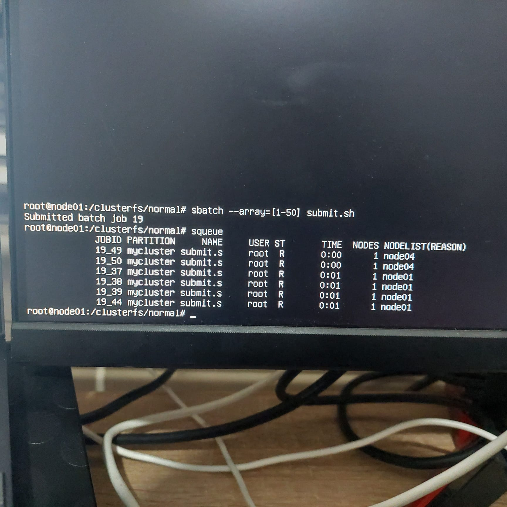
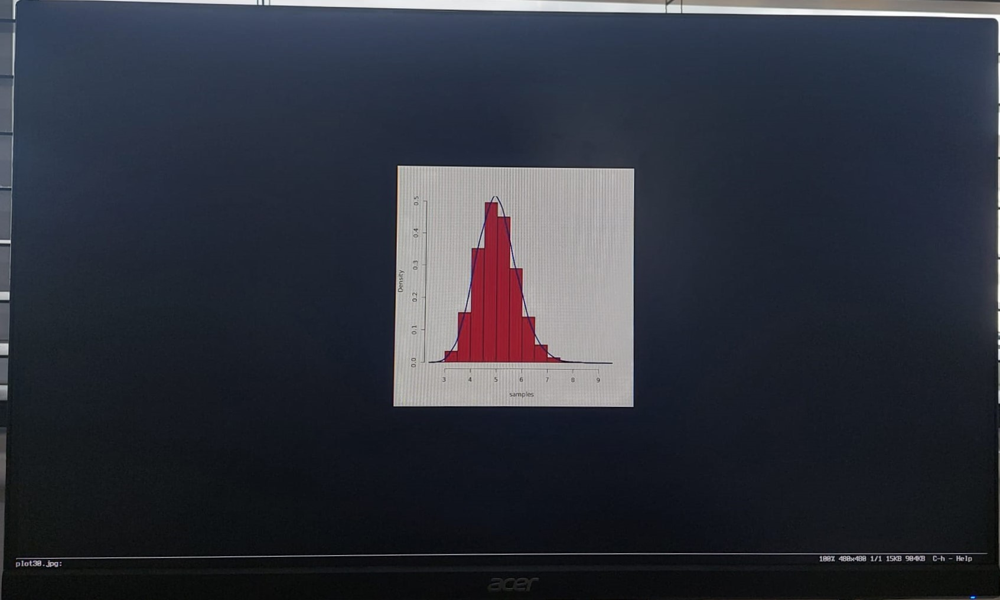
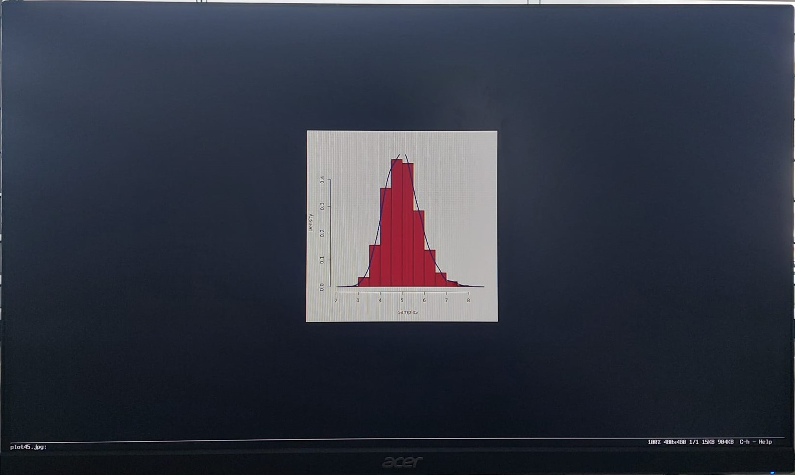

# R Program to generate random values and create graphs and histograms

## INTRODUCTION

Data processing is one of the main use cases of HPC Clusters.R is a programming language for statistical programming Therefore, a simple R program has been built which generate random values following a normal distribution and creates a histogram and graph of those values. The cluster setup is going to be used by ucreating a script to generate 50 randomly generate normal distribution graphs and histogram as images to a folder. In this test the ehad node and one compute node (node04) have been used 

## Components required to generate and run program

In the previous SLURM setup tutorial, a shared directory by mounting a USB drive was created called ```/clusterfs```. Therefore the directory R program generated, the script and results of running the script are stored in the shared storage.

```
├── clusterfs
│   ├── normal
│   │   ├── generate.R
│   │   ├── submit.sh
│   ├── plots
│   │   ├── plto1.jpg      
│   │   ├── plot2.jpg
│   │   ├── .....
│   │   ├── plot49.jpg
│   │   └── plot50.jpg
│ 
```

R needs to be installed on each node. This can be done using srun command on head node

```
sudo su -    // enter super user/root user
srun --nodes=2 apt install r-base -y
```

## R Program

The R program is going to generate graphs based on 10000 samples.
The R program is called ```generate.R``` so we create file 

```sudo nano /clusterfs/normal/generate.R```


The R program does the following
- ```arg = commandArgs(TRUE)``` saves the cmd line arguement passed which is the job id number.
- NA is replicated 10000 times to to create an empty array samples with 10000 empty slots.
- For loop to iterate over each array item and save the result of ```mean(rexp(40, 0.2)).
- ```mean(rexp(40, 0.2))``` generate 40 random values following an exponential distribution with a range of 0.2. The mean of the values is found and stored in an iteration of samples array (stored as an array item). This is repeated 10000 times.
- ```jpeg(paste('plots/', arg, '.jpg', sep=""))``` produces a new jpg file to save the generated graph into. the jpg file will have the name plots/< arg >. Therefore if we run the job 50 times, 50 jpg will be generated corresponding to job id.
- ``hist`` and ```lines``` are used to generate histogram and plot the line.

```
arg = commandArgs(TRUE)
samples = rep(NA, 100000)
for ( i in 1:100000 ){ 
    samples[i] = mean(rexp(40, 0.2)) 
}

jpeg(paste('plots/', arg, '.jpg', sep=""))
hist(samples, main="", prob=T, color="darkred")
lines(density(samples), col="darkblue", lwd=3)
dev.off()
```

## Script Creation
A script needs to be created to submit the job to our partition. The script is named submit.sh and file is created 

```sudo nano /clusterfs/normal/submit.sh```

In the script it is specified to
- run the program using any 1 node but using a single core.
- The partition to be used is also specified.
- After this, the directory is changed to the directory where the SLURM job script was submitted using ```cd $SLURM_SUBMIT_DIR```
- a directory named plots is created 
- R code generate.R is executed where plots are generated with different names based on its jobid. This is done using ```plot$SLURM_ARRAY_TASK_ID```.
- Example: If job ID is 16, plot would have name plot16.jpg.

## Running the Job

The script which handles the running generate.R and storing it in its appropriate location is used and run 50 times.

```
batch --array=[1-50] submit.sh
```

As a result the script will be run 50 times and 50 different plots are generated.
Running squeue shows:

!


above, multiple jobs are running parallelly and are using either of the nodes.
The plots folder has 50 images as it is generated 50 times and 50 slurm outputs are made.

Given below is the output for 3 different plot images. As samples are random, there are slight variations in all of them.





### Reference
1. [Testing with R](https://glmdev.medium.com/building-a-raspberry-pi-cluster-aaa8d1f3d2ca)